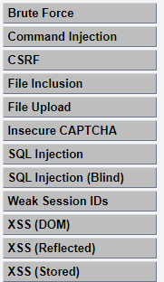
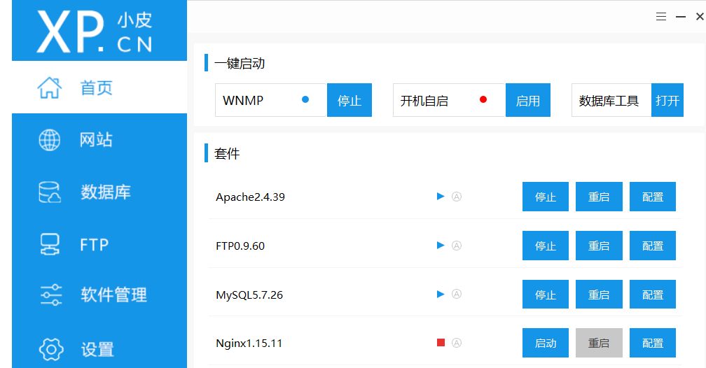
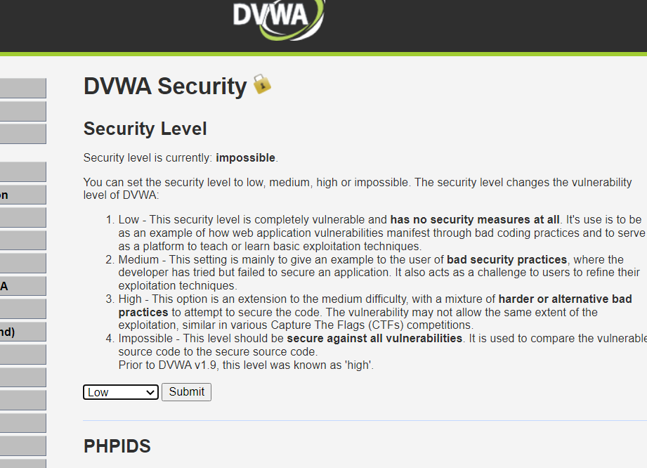

DVWA下载、安装、使用的教程

<!--more-->

DVWA（Damn Vulnerable Web Application）是一个用来进行安全脆弱性鉴定的PHP/MySQL Web应用，旨在为安全专业人员测试自己的专业技能和工具提供合法的环境，帮助web开发者更好的理解web应用安全防范的过程。

# 模块

暴力（破解）、命令行注入、跨站请求伪造、文件包含、文件上传、不安全的验证码、SQL注入、SQL盲注、弱会话ID、XSS漏洞（DOM型跨站脚本、反射型跨站脚本、 存储型跨站脚本）



# 搭建步骤

## 下载DVWA

下载地址：http://www.dvwa.co.uk/

## 下载安装并启动phpstudy

https://www.xp.cn/

phpStudy是一个PHP调试环境的程序集成包。恰好我们可以用到"PHP+Mysql+Apache"。）



## **将下载的DVWA解压到phpstudy网站根目录下**

解压后的路径是“D:\phpStudy\WWW\DVWA-master\”

## **将 config.inc.php.dist 复制一份或重命令为 config.inc.php；**

配置文件路径是“D:\phpStudy\WWW\DVWA-master\config”

## **修改 config.inc.php 里代码**

```
$_DVWA[ 'db_server' ]  = '127.0.0.1'; #数据库地址 $_DVWA[ 'db_database' ] = 'dvwa'; #数据库名称 $_DVWA[ 'db_user' ]   = 'root'; #数据库用户名 $_DVWA[ 'db_password' ] = 'root'; #数据库密码
```

因为phpstudy默认的mysql数据库地址是“127.0.0.1 或 localhost"，用户名和密码都是"root"。主要是修改'db_password‘为root！！！

# DVWA使用

## **设置或重置数据库**

浏览器只需要直接打开“**http://127.0.0.1/DVWA-master/setup.php**”即可！如果有”标红“提示，可能你要打开一些模块或做一些设置，否则有些是不能实验的，例如：文件包含、文件上传漏洞。
拉到下面，点击Setup/Reset DB，点击Create/Reset Database。会看到创建成功提示！

编辑 dvwa/config/config.inc.php这个配置文件

Site key:
6LdJJlUUAAAAAH1Q6cTpZRQ2Ah8VpyzhnffD0mBb

Secret key:
6LdJJlUUAAAAAM2a3HrgzLczqdYp4g05EqDs-W4K

把key填上就行了

```
 $_DVWA[ 'recaptcha_public_key' ] = '6LdJJlUUAAAAAH1Q6cTpZRQ2Ah8VpyzhnffD0mBb'; $_DVWA[ 'recaptcha_private_key' ] = '6LdJJlUUAAAAAM2a3HrgzLczqdYp4g05EqDs-W4K';
```

## **登陆**

浏览器打开”**http://127.0.0.1/DVWA-master/login.php**“登陆。默认用户名：admin，默认密码：password；

## **设置程序安全级别**

浏览器打开”**http://127.0.0.1/DVWA-master/security.php**“来做设置，分别有”低、中、高、不可能“，程序安全级别越低，说明越容易被攻破，没有做任何的安全防护。主要是用来自我挑战不同等级的程序防护级别的！


