Web经典题型及其相关解题步骤

<!--more-->

# Get和Post

在web中最简单且最重要的就是get和post的相关方法，对于Get的方法如下：

借用Bugctf平台中的题

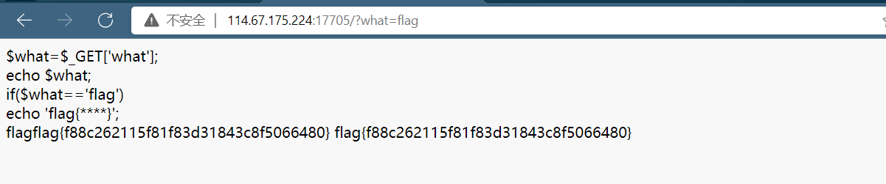

Get就是直接在网址上面直接加

```
/？***
```

具体根据对应题来写。

对于Post的方法如下：

Post需要借助相关插件hackber来进行，这在各浏览器都可以下载，推荐使用火狐浏览器

这个的借用题和上面的Get几乎一样，这里就不放图了，上重点，用hackber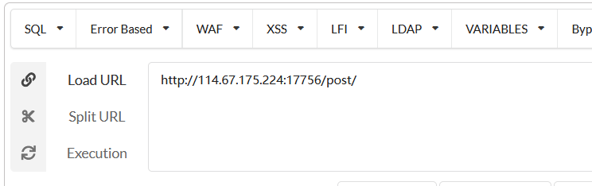

然后根据题意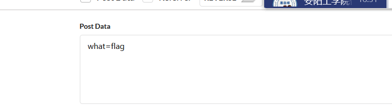

就可以顺利得到flag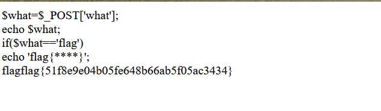

# Simple_SSTI_1

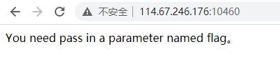

- 这个题目是`SSTI`（`Server-Side Template Injection`）服务器端模板注入

- 查看源代码，下方提示的是`flask`和`secret_key`
  `flask`是`python`的一个`web`框架

- 相关资料参考一下链接

     

  [flask之ssti模板注入初窥]: https://www.cnblogs.com/awsole/p/14589579.html
  [1. SSTI（模板注入）漏洞（入门篇）]: https://www.cnblogs.com/bmjoker/p/13508538.html
  [Flask之config.py配置文件中的常用配置]: https://blog.csdn.net/weixin_45950544/article/details/103850079

  

拿到题先看源代码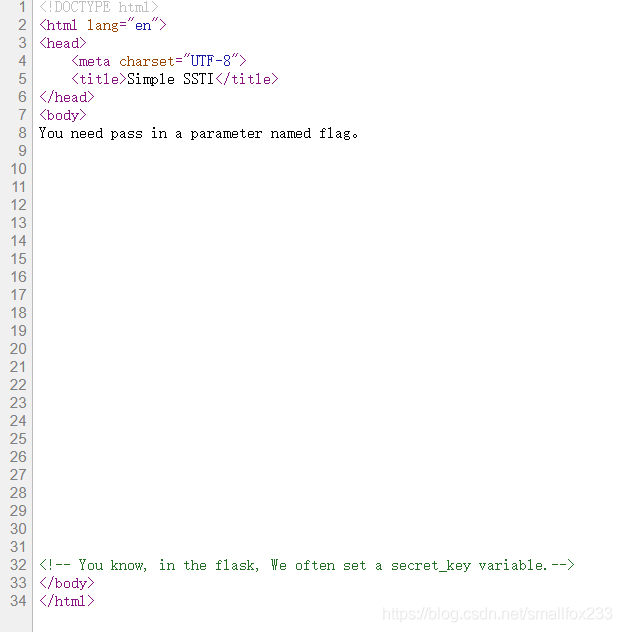

要我们传入一个flag参数，用post直接报错，那么就选择采用get方式，看源代码发现在[flask](https://so.csdn.net/so/search?q=flask)里，经常设置一个secret_key变量。

> 传入一个`flag`参数，用两个括号括起来一个表达式或者是变量，返回对应的表达式或变量的值。

尝试后发现成功回显，则输入config查看变量内容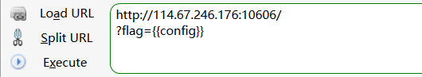

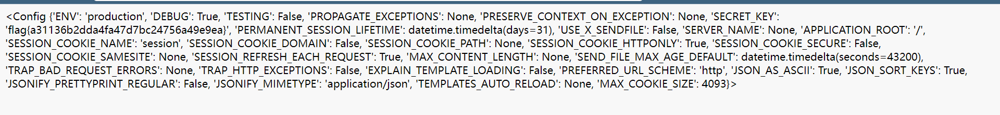

在这里找到了flag！

其次，因为题目提示`flag`值是在`SECRET_KEY`中，也可以修改成`config.SECRET_KEY`来访问变量的值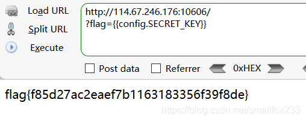

# 矛盾

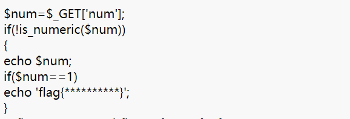

> 这是php弱类型，题的意思就是如果num不能是数字就输出num，如果num=1就输出flag{}，看似矛盾其实不矛盾，只需要/？flag=1*就可以，就是让1后面有其他字符，这样两个式子都成立，就可以得到flag。
>
> 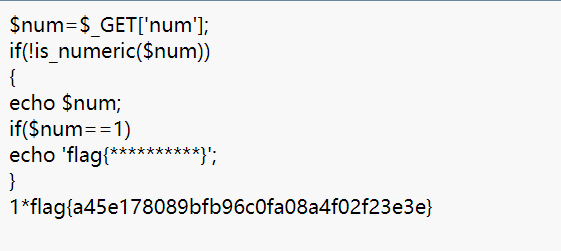

# 平台推荐

|            平台名            |                       网址                       |
| :--------------------------: | :----------------------------------------------: |
|         合天网安CTF          | http://www.hetianlab.com/pages/CTFLaboratory.jsp |
|         XCTF攻防世界         |           https://adworld.xctf.org.cn/           |
|         i春秋 (推荐)         |      https://www.ichunqiu.com/battalion?t=1      |
|       南京邮电大学CTF        |    https://cgctf.nuptsast.com/challenges#Web     |
|   网络信息安全攻防学习平台   |          http://hackinglab.cn/index.php          |
| BUUCTF 北京联合大学CTF(推荐) |                https://buuoj.cn/                 |
|            CTFHub            |          https://www.ctfhub.com/#/index          |
|           BugkuCTF           | https://ctf.bugku.com/ https://www.amanctf.com/  |
|           看雪CTF            |              https://ctf.pediy.com/              |
|           DCN-CTF            |                http://dcnctf.com/                |
|            NSCTF             |              http://ctft.nsctf.cn/               |
|           航电CTF            |              http://sec.hdu.edu.cn/              |
|        hacker101 CTF         |            https://ctf.hacker101.com/            |
|             WCTF             |               https://ctf.360.com/               |
|       实验吧（升级中）       |            http://www.shiyanbar.com/             |
|            封神台            |          https://hack.zkaq.cn/?a=battle          |
|            Ctf秀             |                https://ctf.show/                 |
|         必火CTF培训          |          https://www.bihuoedu.com/ctf/           |

刷题平台推荐参考:

[时光不改](https://www.cnblogs.com/zhaijiahui/)

