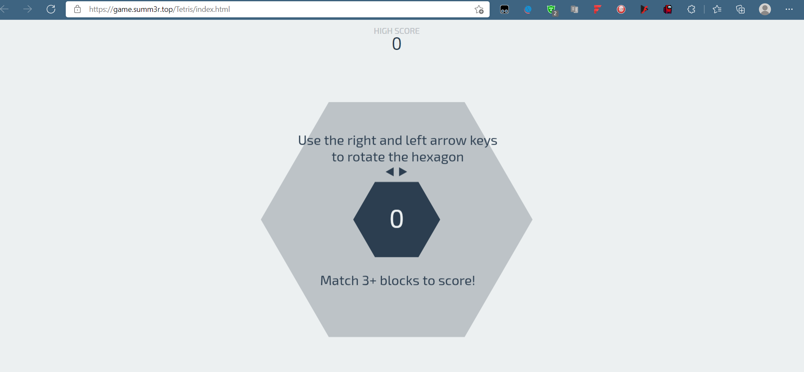
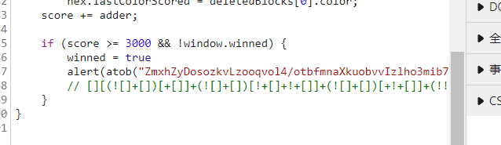
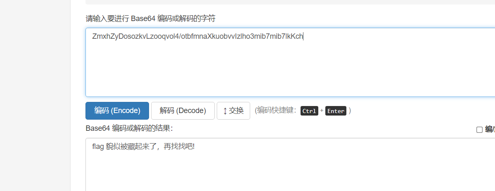
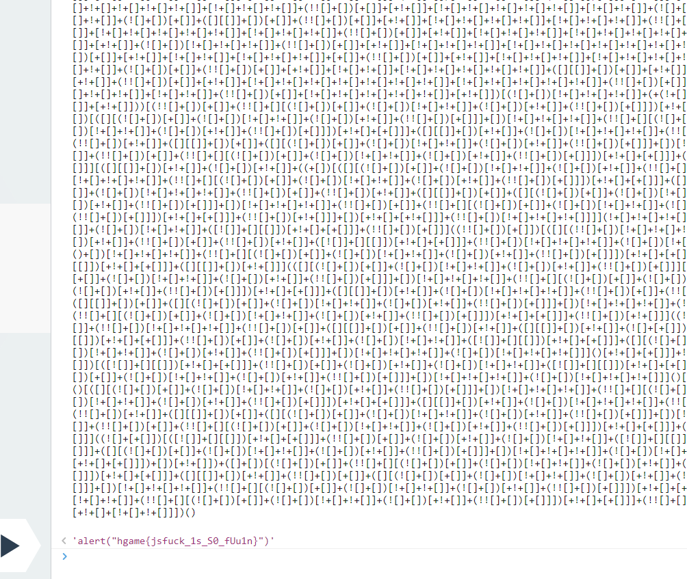
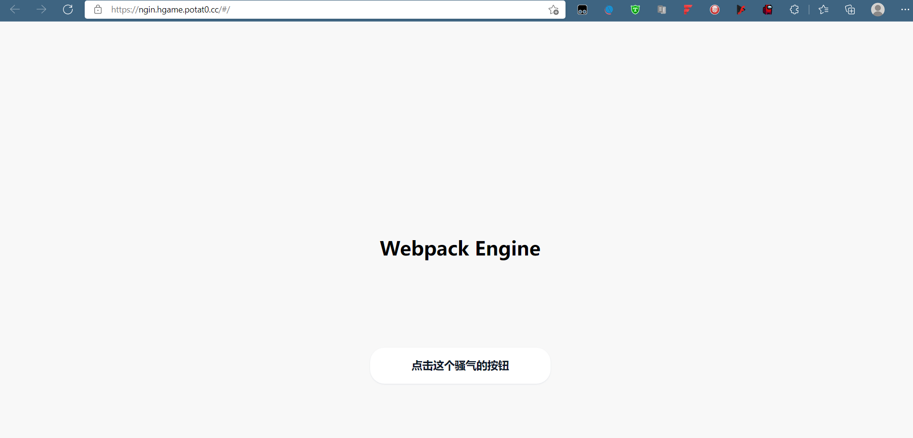
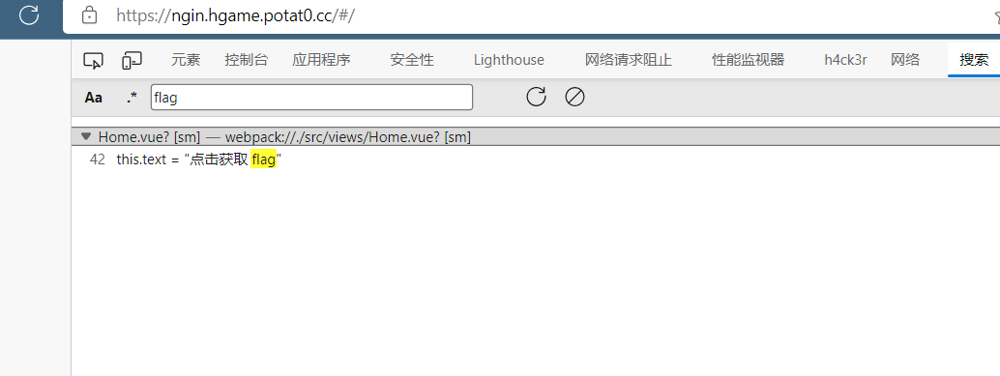
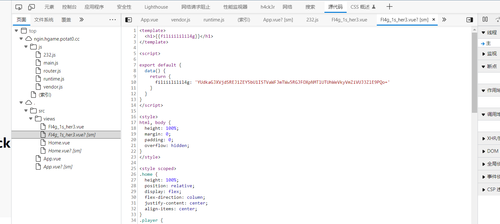
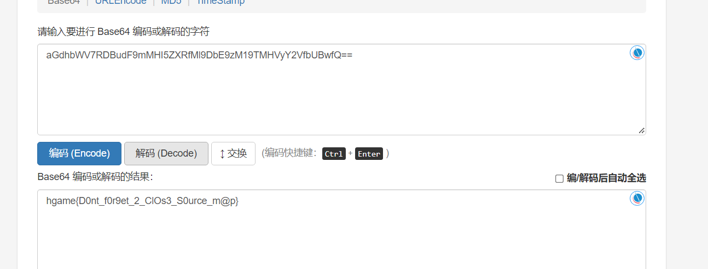
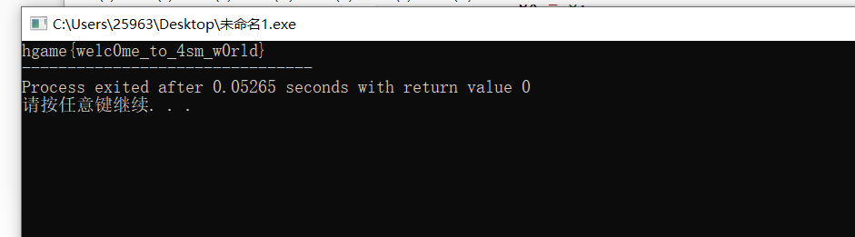

hgame2022复现记录一下！

<!--more-->

# web

## Tetris plus





是个游戏题，分数到3000就是胜利，闲着无聊打通关了！但是没有flag，欺骗我，但是我感觉这个红色字体特别想base64，尝试了一下！

下面的注释是jsfuck，应该是加密吧，把下面的jsfuck复制到控制台，enter出flag!

## webpack-engine



这又是个啥玩意，看源代码！没有发现啥有用的，搜索一下flag试试

显然这个应该flag就在源代码里吧

base64解码，得到flag！（两次）

# re

## easyasm

根据汇编写个c,直接输出

```c
#include<iostream>
int main()
{
	char ds[0x1c]={0x91,0x61,0x1,0xc1,0x41,0xa0,0x60,0x41,0xd1,0x21,0x14,0xc1,0x41,0xe2,0x50,0xe1,0xe2,0x54,0x20,0xc1,0xe2,0x60,0x14,0x30,0xd1,0x51,0xc0,0x17};
	short ax,bx;
	char al,bl;
	char c;
	for(int i=0;i<0x1c;i++){
		c = ds[i];
		c = c^0x17;
		for(char j=0;j<128;j++){
			 ax = 0;
	         al = j;
	         al = al << 4;
	         ax += al;
	         bx = 0;
	         bl = j;
	         bl = bl >> 4;
	         bx += bl;
	         ax += bx;
             al = (ax << 8) >> 8;
             if(al == c){
             	printf("%c",j);
             	break;
			 }			
		}
	}
 } 
```



推荐：

速成x86汇编学习网址：https://www.cnblogs.com/YukiJohnson/archive/2012/10/27/2741836.html
