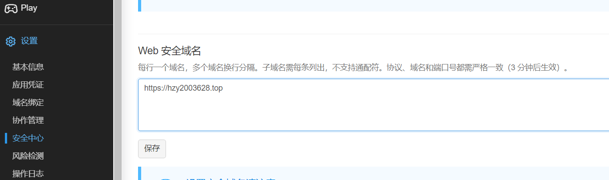
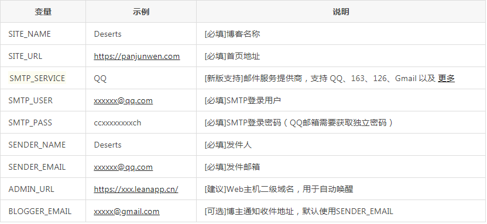
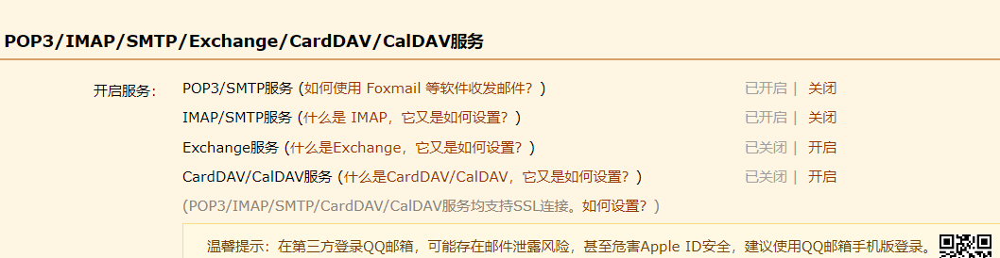
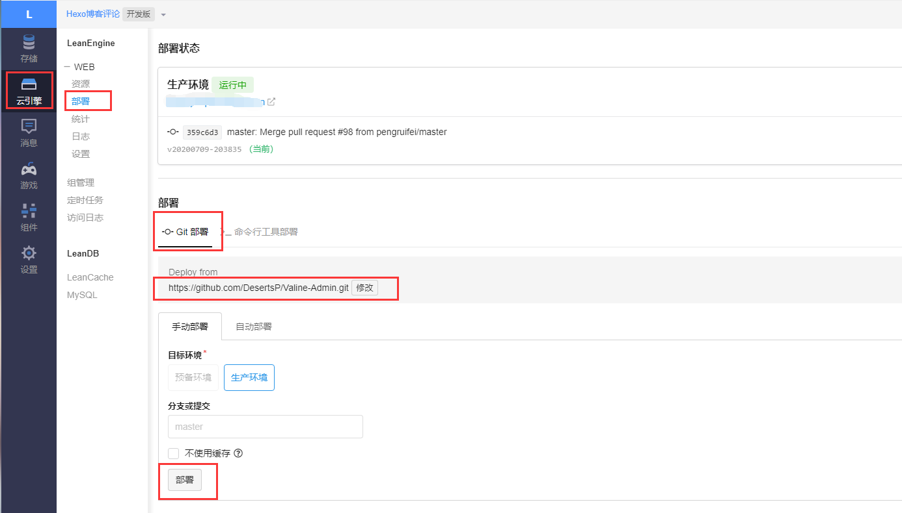
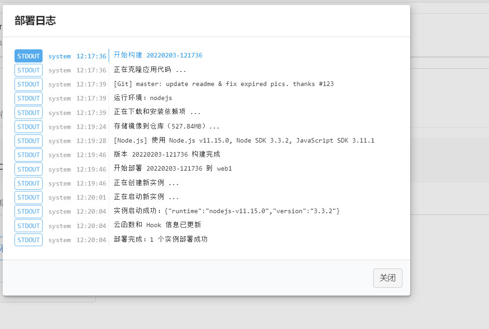
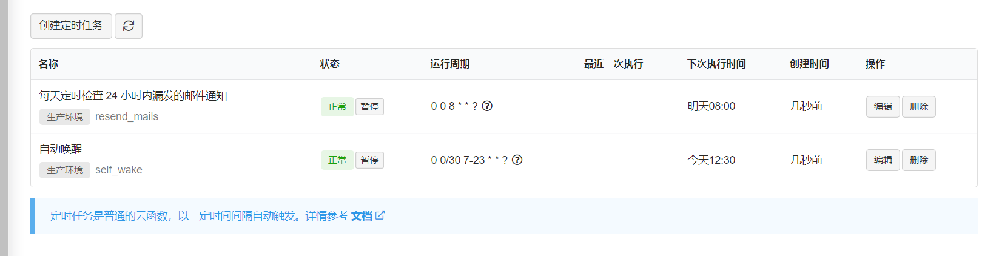
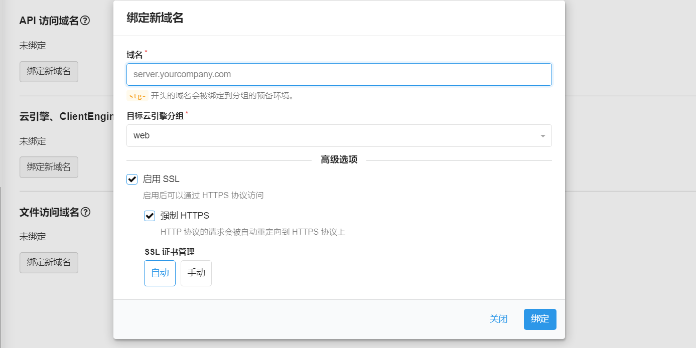

Hexo NexT 评论系统 Valine 的使用

<!--more-->

这个valine评论系统我感觉很方便，不用进行繁琐的登录就可评论，在这里说一下配置方法！

# 开启评论系统

1注册 [LeanCloud](https://leancloud.cn/)

2.创建 Valine 应用，名称任意

3.进入对应的应用，点击 `设置 -> 应用 Keys`，获取 `AppID` 和 `AppKey`

4 在 Hexo 博客主题配置文件 `next/_config.yml` 中进行配置，可根据自己喜好来设置该评论系统。

```
valine:
  enable: true # 设置为true，默认为false
  appid:  # 将应用key的App ID设置在这里
  appkey: # 将应用key的App Key设置在这里
  notify: false# 邮箱通知 , https://github.com/xCss/Valine/wiki，默认为false
  verify: false# 验证码 默认为false
  placeholder: Just go go ^_^ # 初始化评论显示，根据自己修改，这里默认，
  avatar: monsterid # 头像风格，默认为mm，可进入网址：https://valine.js.org/visitor.html查看头像设置，这里有许多头像风格，进行设置
  guest_info: nick,mail,link # 自定义评论标题
  pageSize: 10 # 分页大小，10页就自动分页
  visitor: true # 是否允许游客评论 ，进入官网查看设置：https://valine.js.org/visitor.html
```

这样就可以开启此评论系统！

## Valine 的配置

## 查看评论

点击 `存储 -> 结构化数据`，选择 `创建 Class`，名称 `Comment`，其他保持默认，以后就可在此 Class 内查看

> 注：选择 `Valine` 评论系统是因为支持国内网络，不需要连接外网（翻墙）就可以进行显示评论系统，而且很好管理，页面简单

## 文章阅读量统计

点击 `存储 -> 结构化数据`，选择`创建 Class`，名称 `Counter`，其他保持默认，以后就可在此 Class 内查看

在 leancloud 中的应用设置界面中，通过【设置 | 安全中心】菜单，将我们博客的域名添加到安全中心，

如下：

#  邮件通知功能

####  原邮箱模板通知功能

修改主题配置文件：notify改成 true

- 打开 LeanCloud 的控制台，然后进入应用的设置界面，然后通过【云引擎 | 设置】菜单，进入到云引擎的相关配置面板，然后在"自定义环境变量"处新建以下变量名和值：

  | ADMIN_URL     | https://hzy2003628.top |
  | ------------- | ---------------------- |
  | AKISMET_KEY   | 垃圾                   |
  | BLOGGER_EMAIL | 2596328958@qq.com      |
  | SENDER_EMAIL  | 2596328958@qq.com      |
  | SENDER_NAME   | 小元                   |
  | SITE_NAME     | 风尘孤狼               |
  | SITE_URL      | https://hzy2003628.top |
  | SMTP_PASS     |                        |
  | SMTP_SERVICE  | QQ                     |
  | SMTP_USER     | 2596328958@qq.com      |
  | TEMPLATE_NAME | custom2                |

  - `SITE_NAME` : 网站名称。
  
  - `SITE_URL` : 网站地址, **最后不要加 `/` 。**
  
  - `SMTP_USER` : SMTP 服务用户名，一般为邮箱地址。
  
  - `SMTP_PASS` : SMTP 密码，一般为授权码，而不是邮箱的登陆密码，请自行查询对应邮件服务商的获取方式
  
  - `SMTP_SERVICE` : 邮件服务提供商，支持 `QQ`、`163`、`126`、`Gmail`、`"Yahoo"`、`......` ，全部支持请参考 : [Nodemailer Supported services](https://nodemailer.com/smtp/well-known/#supported-services)。 — *如这里没有你使用的邮件提供商，请查看[自定义邮件服务器](https://github.com/zhaojun1998/Valine-Admin/blob/master/高级配置.md#自定义邮件服务器)*
  
  - `SENDER_NAME` : 寄件人名称。
  
    

关于"SMTP_PASS"的值获取方式如下：

首先打开 QQ 邮箱界面，然后依次点击【设置 | 账户】菜单，如下：



然后点击下方，开启 IMAP/SMTP 服务，开启后会得到一串字符串，将那一串字符串复制粘贴到云引擎面板中的"SMTP_PASS"属性后面作为它的值。

- 接下来部署生产环境。依次点击【云引擎 | 部署】菜单，打开部署界面，然后通过如下所示部署 Valine-Admin，如下：



以上的 GitHub 地址如下"https://github.com/DesertsP/Valine-Admin.git"，必须配置这个地址。

部署

- 部署成功后，我们设置定时任务，因为免费的 LeanCloud 会有自动休眠模式，所以要设置定时任务然它自动重启，操作过程如下：



> 1. `自动唤醒
>    Cron 表达式为 0 0/30 7-23 * * ? 表示每天早 7 点到晚 23 点每隔 30 分钟访问云引擎
> 2. 每天定时检查 24 小时内漏发的邮件通知
>    Cron 表达式为 0 0 8 * * ? 定时检查 24 小时内漏发的邮件通知

- 定时任务设置完成后，为云引擎绑定一个域名，为了保证后续邮件提醒功能正常。但是在此处要求是一个备案的域名，这样绑定即可：（点击云引擎绑定新域名）



至此邮箱通知就完成了！
