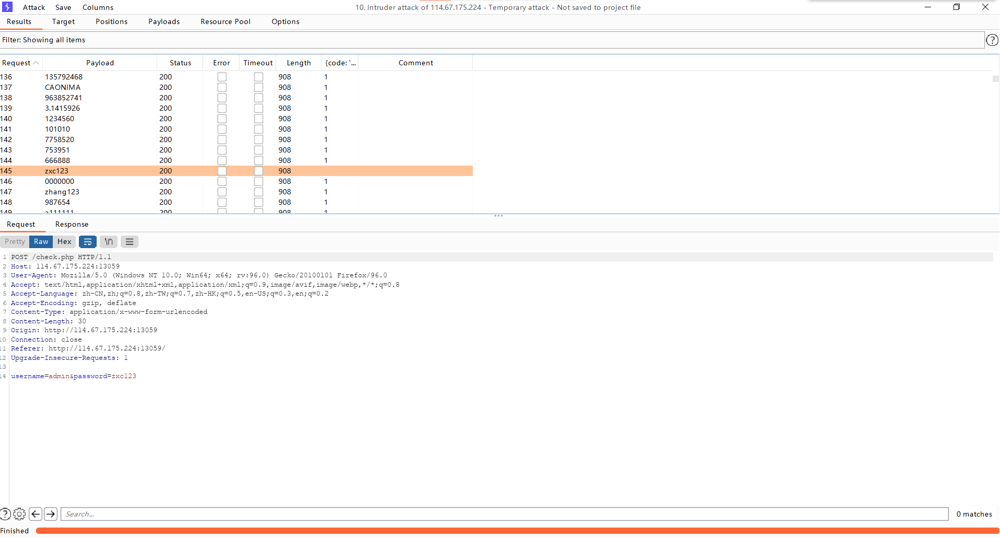

单纯爆破题型,做个记录吧！
<!--more-->

web中爆破必不可少！通过一个题深入了解一下。

这个题有提示，弱密码top1000，以及是六位密码，开头是z，这是通过题目知道的信息。

一个登陆界面，账号已经给了是admin，所以bp爆破密码即可！但是当爆破的时候就会发现回显的长度都是一样的。

这个时候说实话真的难倒我了。记得之前看到的是找到不一样的回响长度的那个就是正确的密码，点开响应包可以发现

只要是错误密码都会有{code: 'bugku10000'}的数据包。

点击Intruder中的options选项卡找到Grep-Match（在响应中找出存在指定的内容的一项。）在输入框中我们输入{code: 'bugku10000'}之后点击Add添加。然后再爆破一次！

这个时候有意外收获，我发现唯独有一个数据是没有上面那个数据包的

这说明啥？显然这是密码，因为那个数据包是错误密码特有的！登陆测试发现密码正确！

**总结**

对于bp爆破这个玩意，基本上复杂点的爆破就是这样了，其次爆破其实并不仅仅只能爆破知道用户名不知道密码的，当我们不知道用户名也不知道密码的时候照样可以爆破，下面图的payload set说通俗一点就是爆破位置有几个

当我们只要爆破密码的时候就是1，爆破用户名和密码的时候就是2，以此类推，当然有一个高质量的弱密码文本还是会减少很多不必要的麻烦的，关于bp爆破就说到这吧！
